# Showcase your skills on your GitHub or resumé with ease!
Powered by Cloudflare Workers ⚡

# Docs

- [Showcase your skills on your GitHub or resumé with ease!](#showcase-your-skills-on-your-github-or-resumé-with-ease)
- [Docs](#docs)
- [TODO:](#todo)
- [Example](#example)
- [Specifying Icons](#specifying-icons)
- [Themed Icons](#themed-icons)
- [Icons Per Line](#icons-per-line)
- [Centering Icons](#centering-icons)
- [New icons progress](#new-icons-progress)
- [New versions of icons to update](#new-versions-of-icons-to-update)
- [Icons List](#icons-list)

# TODO:

- [ ] Add most, if not all of the icons from the [skill-icons issues tab](https://github.com/tandpfun/skill-icons/issues).
- [ ] Add support for customisable gaps, padding, sizing, rotation.
- [ ] Possible support for clickable icons.
- [ ] Possible different colour palettes.
- [ ] Possible auto light/dark theme mode.
- [ ] Remove the need for the SVGs to be kept on the worker, possibly host them in the repo.
- [ ] Create a website for custom icon picking.

# Example

<p align="center"></p>
<p align="center"></p>

# Specifying Icons

Copy and paste the code block below into your readme to add the skills icon element!

Change the `?i=js,html,css` to a list of your skills separated by ","s! You can find a full list of icons [here](#icons-list).

```md
[](https://skillicons.dev)
```

[](https://skillicons.dev)

# Themed Icons

Some icons have a dark and light themed background. You can specify which theme you want as a url parameter.

This is optional. The default theme is dark.

Change the `&theme=light` to either `dark` or `light`. The theme is the background color, so light theme has a white icon background, and dark has a black-ish.

**Light Theme Example:**

```md
[](https://skillicons.dev)
```

[](https://skillicons.dev)

# Icons Per Line

You can specify how many icons you would like per line! It's an optional argument, and the default is 15.

Change the `&perline=3` to any number between 1 and 50.

```md
[](https://skillicons.dev)
```

[](https://skillicons.dev)

# Centering Icons

Want to center the icons in your readme? The SVGs are automatically resized, so you can do it the same way you'd normally center an image.

```html
<p align="center">
  <a href="https://skillicons.dev">
    
  </a>
</p>
```

<p align="center">
  <a href="https://skillicons.dev">
    
  </a>
</p>

# New icons progress

|      Icon ID       |                         Icon                          | Finished |
| :----------------: | :---------------------------------------------------: | :------: |
| `hono` |  | [ ] |
| `vagrant` |  | [ ] |
| `fiber` |  | [ ] |
| `medium` |  | [ ] |
| `geogebra` |  | [ ] |
| `wolfram` |  | [ ] |
| `wsl` |  | [ ] |
| `compose` |  | [ ] |
| `canva` |  | [ ] |
| `fivetran` |  | [ ] |
| `oracledb` |  | [ ] |
| `mssql` |  | [ ] |
| `tableau` |  | [ ] |
| `msdos` |  | [ ] |
| `inertiajs` |  | [ ] |
| `servicenow` |  | [ ] |
| `flutterflow` |  | [ ] |
| `netbeans` |  | [ ] |
| `bsky` |  | [ ] |
| `youtube` |  | [ ] |
| `helm` |  | [ ] |
| `playcanvas` |  | [ ] |
| `stan` |  | [ ] |
| `xhtml` |  | [ ] |
| `payara` |  | [ ] |
| `testng` |  | [ ] |
| `fastlane` |  | [ ] |
| `steam` |  | [ ] |
| `mariadb` |  | [ ] |
| `spline` |  | [ ] |
| `dockercompose` |  | [ ] |
| `davinciresolve` |  | [ ] |
| `motoko` |  | [ ] |
| `framer` |  | [ ] |
| `devextreme` |  | [ ] |
| `hashnode` |  | [ ] |
| `reactnative` |  | [ ] |
| `vegaspro` |  | [ ] |
| `pwa` |  | [ ] |
| `cpanel` |  | [ ] |
| `intellijidea` |  | [ ] |
| `lightroom` |  | [ ] |
| `whatsapp` |  | [ ] |
| `facebook` |  | [ ] |
| `stata` |  | [ ] |
| `lottie` |  | [ ] |
| `pytest` |  | [ ] |
| `leetcode` |  | [ ] |
| `navicat` |  | [ ] |
| `argocd` |  | [ ] |
| `coolify` |  | [ ] |
| `gimp` |  | [ ] |
| `unocss` |  | [ ] |
| `telegram` |  | [ ] |
| `socketio` |  | [ ] |
| `sentry` |  | [ ] |
| `posthog` |  | [ ] |
| `passportjs` |  | [ ] |
| `appium` |  | [ ] |
| `snowflake` |  | [ ] |
| `dbt` |  | [ ] |
| `xampp` |  | [ ] |
| `eslint` |  | [ ] |
| `playwright` |  | [ ] |
| `rspack` |  | [ ] |
| `rsbuild` |  | [ ] |
| `storybook` |  | [ ] |
| `mermaid` |  | [ ] |
| `neo4j` |  | [ ] |
| `jwt` |  | [ ] |
| `skeletonui` |  | [ ] |
| `twillio` |  | [ ] |
| `streamlit` |  | [ ] |
| `insomnia` |  | [ ] |
| `flstudio` |  | [ ] |
| `sap` |  | [ ] |
| `abap` |  | [ ] |
| `assembly` |  | [ ] |
| `wasm` |  | [ ] |
| `django` |  | [ ] |
| `affinitydesigner` |  | [ ] |
| `affinityphoto` |  | [ ] |
| `affinitypublisher` |  | [ ] |
| `inkscape` |  | [ ] |
| `fusion360` |  | [ ] |
| `gromacs` |  | [ ] |
| `robotpy` |  | [ ] |
| `bruno` |  | [ ] |
| `objectivec` |  | [ ] |
| `bsd` |  | [ ] |
| `freebsd` |  | [ ] |
| `zeabur` |  | [ ] |
| `vuesticui` |  | [ ] |
| `quasar` |  | [ ] |
| `vitepress` |  | [ ] |
| `rolldown` |  | [ ] |
| `microwebsockets` |  | [ ] |
| `vike` |  | [ ] |
| `podman` |  | [ ] |
| `esbuild` |  | [ ] |
| `biome` |  | [ ] |
| `puppeteer` |  | [ ] |
| `pkgroll` |  | [ ] |
| `jotai` |  | [ ] |
| `tanstack` |  | [ ] |
| `daisyui` |  | [ ] |
| `burpsuite` |  | [ ] |
| `nano` |  | [ ] |
| `fedora` |  | [ ] |
| `flatpak` |  | [ ] |
| `r` |  | [ ] |
| `hyprland` |  | [ ] |
| `sqlc` |  | [ ] |
| `typeorm` |  | [ ] |
| `chatgpt` |  | [ ] |
| `claude` |  | [ ] |
| `perplexity` |  | [ ] |
| `gemini` |  | [ ] |
| `blazor` |  | [ ] |
| `ffmpeg` |  | [ ] |
| `lodash` |  | [ ] |
| `datadog` |  | [ ] |
| `handlebars` |  | [ ] |
| `framerone` |  | [ ] |
| `axos` |  | [ ] |
| `axios` |  | [ ] |
| `vmware` |  | [ ] |
| `gnu` |  | [ ] |
| `googlesheets` |  | [ ] |
| `xcode` |  | [ ] |
| `reactrouter` |  | [ ] |
| `matplotlib` |  | [ ] |
| `babylonjs` |  | [ ] |
| `mongoose` |  | [ ] |
| `apachejmeter` |  | [ ] |
| `shopify` |  | [ ] |
| `geodesdk` |  | [ ] |
| `odin` |  | [ ] |
| `crystallang` |  | [ ] |
| `influxdb` |  | [ ] |
| `pulimi` |  | [ ] |
| `polars` |  | [ ] |
| `cockroachdb` |  | [ ] |
| `kicad` |  | [ ] |
| `gsap` |  | [ ] |
| `pandas` |  | [ ] |
| `numpy` |  | [ ] |
| `ghostty` |  | [ ] |
| `zsh` |  | [ ] |
| `unicode` |  | [ ] |
| `love2d` |  | [ ] |
| `unrealengine` |  | [ ] |
| `pinescript` |  | [ ] |
| `huggingface` |  | [ ] |
| `timeshift` |  | [ ] |
| `jira` |  | [ ] |
| `render` |  | [ ] |
| `r3f` |  | [ ] |
| `r3r` |  | [ ] |
| `phoenix` |  | [ ] |
| `antdesign` |  | [ ] |
| `inertia` |  | [ ] |
| `karpenter` |  | [ ] |
| `twine` |  | [ ] |
| `ionic` |  | [ ] |
| `turborepo` |  | [ ] |
| `batch` |  | [ ] |
| `fork` |  | [ ] |
| `foundry` |  | [ ] |
| `stackblitz` |  | [ ] |
| `revolt` |  | [ ] |
| `cucumber` |  | [ ] |
| `notepadpp` |  | [ ] |
| `webdriverio` |  | [ ] |
| `defold` |  | [ ] |
| `resend` |  | [ ] |
| `havok` |  | [ ] |
| `audacity` |  | [ ] |
| `doppler` |  | [ ] |
| `firebird` |  | [ ] |
| `ollama` |  | [ ] |
| `trello` |  | [ ] |
| `slack` |  | [ ] |
| `linear` |  | [ ] |
| `mojo` |  | [ ] |
| `gleam` |  | [ ] |
| `protonmail` |  | [ ] |
| `rustrover` |  | [ ] |
| `rubymine` |  | [ ] |
| `goland` |  | [ ] |
| `datagrip` |  | [ ] |
| `gitea` |  | [ ] |
| `semgrep` |  | [ ] |
| `googlecolab` |  | [ ] |
| `chakraui` |  | [ ] |
| `twitch` |  | [ ] |
| `comfyui` |  | [ ] |
| `aseprite` |  | [ ] |
| `drizzle` |  | [ ] |
| `drizzleorm` |  | [ ] |
| `leaflet` |  | [ ] |
| `lunacy` |  | [ ] |
| `pygame` |  | [ ] |
| `cuda` |  | [ ] |
| `icedrs` |  | [ ] |
| `oraclesqldeveloper` |  | [ ] |
| `vi` |  | [ ] |
| `livewire` |  | [ ] |
| `lightningcss` |  | [ ] |
| `stylus` |  | [ ] |
| `recharts` |  | [ ] |
| `shadcnui` |  | [ ] |
| `d` |  | [ ] |
| `angular` |  | [ ] |
| `pillow` |  | [ ] |
| `arc` |  | [ ] |
| `zen` |  | [ ] |
| `qmk` |  | [ ] |
| `yii` |  | [ ] |
| `dbeaver` |  | [ ] |
| `insomnia` |  | [ ] |
| `digitalocean` |  | [ ] |
| `planetscale` |  | [ ] |
| `neondb` |  | [ ] |
| `lumen` |  | [ ] |
| `groovy` |  | [ ] |
| `orca` |  | [ ] |
| `lynx` |  | [ ] |
| `zustand` |  | [ ] |
| `nextui` |  | [ ] |
| `radixui` |  | [ ] |
| `directus` |  | [ ] |
| `visualbasic` |  | [ ] |
| `tidb` |  | [ ] |
| `milvus` |  | [ ] |
| `opengl` |  | [ ] |
| `trpc` |  | [ ] |
| `streamlit` |  | [ ] |
| `holyc` |  | [ ] |
| `rubymine` |  | [ ] |
| `zoom` |  | [ ] |
| `pascal` |  | [ ] |
| `turso` |  | [ ] |
| `turst` |  | [ ] |
| `twig` |  | [ ] |
| `opensuse` |  | [ ] |
| `joomla` |  | [ ] |
| `scikitlearn` |  | [ ] |
| `excel` |  | [ ] |
| `pocketbase` |  | [ ] |
| `scratch` |  | [ ] |
| `microtik` |  | [ ] |
| `vyos` |  | [ ] |
| `pihole` |  | [ ] |
| `stripe` |  | [ ] |
| `auth0` |  | [ ] |
| `betterauth` |  | [ ] |
| `supertokens` |  | [ ] |
| `swiftui` |  | [ ] |
| `effector` |  | [ ] |
| `odoo` |  | [ ] |
| `fastify` |  | [ ] |
| `typst` |  | [ ] |
| `hono` |  | [ ] |
| `springboot` |  | [ ] |
| `warp` |  | [ ] |
| `lvgl` |  | [ ] |
| `socketio` |  | [ ] |
| `adobefonts` |  | [ ] |
| `androidstudio` |  | [ ] |
| `dreamweaver` |  | [ ] |
| `homeassistant` |  | [ ] |
| `astro` |  | [ ] |
| `blazejs` |  | [ ] |
| `nestjs` |  | [ ] |
| `payloadcms` |  | [ ] |
| `expo` |  | [ ] |
| `bitbucket` |  | [ ] |
| `grails` |  | [ ] |
| `cobol` |  | [ ] |
| `capacitor` |  | [ ] |
| `googleapi` |  | [ ] |
| `ibmcloud` |  | [ ] |
| `knockoutjs` |  | [ ] |
| `codesandbox` |  | [ ] |
| `kofi` |  | [ ] |
| `wireshark` |  | [ ] |
| `solidjs` |  | [ ] |
| `solidstart` |  | [ ] |
| `knexjs` |  | [ ] |
| `mantine` |  | [ ] |
| `gin` |  | [ ] |
| `javafx` |  | [ ] |
| `drawio` |  | [ ] |
| `clion` |  | [ ] |
| `virtualbox` |  | [ ] |
| `vuejs` |  | [ ] |
| `codeblocks` |  | [ ] |
| `reactquery` |  | [ ] |
| `notion` |  | [ ] |
| `freecodecamp` |  | [ ] |
| `erlang` |  | [ ] |
| `deno` |  | [ ] |
| `turbopack` |  | [ ] |
| `opencv` |  | [ ] |
| `jupyternotebook` |  | [ ] |
| `applescript` |  | [ ] |
| `lisp` |  | [ ] |
| `vscinsiders` |  | [ ] |
| `sublimetext` |  | [ ] |
| `sveltekit` |  | [ ] |
| `svelte` |  | [ ] |
| `phpstorm` |  | [ ] |
| `npm` |  | [ ] |
| `jsr` |  | [ ] |
| `yarn` |  | [ ] |
| `tmux` |  | [ ] |
| `testcontainers` |  | [ ] |
| `zod` |  | [ ] |
| `standardschema` |  | [ ] |
| `pixijs` |  | [ ] |
| `awslambda` |  | [ ] |
| `rxjs` |  | [ ] |
| `quik` |  | [ ] |
| `nextauth` |  | [ ] |
| `googlebigquery` |  | [ ] |
| `julia` |  | [ ] |
| `postgres` |  | [ ] |
| `opentelemetry` |  | [ ] |
| `elm` |  | [ ] |
| `flyio` |  | [ ] |
| `webrtc` |  | [ ] |
| `kaggle` |  | [ ] |
| `linkedin` |  | [ ] |
| `vb` |  | [ ] |
| `vba` |  | [ ] |
| `vbscript` |  | [ ] |
| `delphi` |  | [ ] |
| `reatom` |  | [ ] |
| `discordjs` |  | [ ] |
| `scylladb` |  | [ ] |
| `ajax` |  | [ ] |
| `mui` |  | [ ] |
| `apple` |  | [ ] |
| `protobuf` |  | [ ] |
| `grpc` |  | [ ] |
| `clickhouse` |  | [ ] |
| `postman` |  | [ ] |
| `postcss` |  | [ ] |
| `fontawesome` |  | [ ] |
| `hexo` |  | [ ] |
| `px4autopilot` |  | [ ] |
| `mocha` |  | [ ] |
| `chai` |  | [ ] |
| `xamarin` |  | [ ] |
| `vulkan` |  | [ ] |
| `directX` |  | [ ] |
| `surrealdb` |  | [ ] |
| `venv` |  | [ ] |
| `gentoo` |  | [ ] |

# New versions of icons to update

|      Icon ID       |                         Icon                          | Finished |
| :----------------: | :---------------------------------------------------: | :------: |
| `firebase` |  | [ ] |
| `x` |  | [ ] |
| `deno` |  | [ ] |
| `c` |  | [ ] |
| `css` |  | [ ] |
| `jetbrains` |  | [ ] |
| `ocaml` |  | [ ] |
| `ember` |  | [ ] |
| `angular` |  | [ ] |

# Icons List

Here's a list of all the icons currently supported. Feel free to open an issue to suggest icons to add!

|      Icon ID       |                         Icon                          |
| :----------------: | :---------------------------------------------------: |
|     `ableton`      |  |
|   `activitypub`    |  |
|      `actix`       | 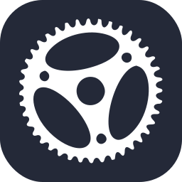 |
|      `adonis`      |  |
|        `ae`        |  |
|     `aiscript`     |  |
|     `alpinejs`     |  |
|     `anaconda`     |  |
|  `androidstudio`   |  |
|     `angular`      |  |
|     `ansible`      |  |
|      `apollo`      |  |
|      `apple`       |  |
|     `appwrite`     |  |
|       `arch`       |  |
|     `arduino`      |  |
|       `atom`       |  |
|        `au`        |  |
|     `autocad`      |  |
|       `aws`        |  |
|       `azul`       |  |
|      `azure`       |  |
|      `babel`       |  |
|       `bash`       |  |
|       `bevy`       |  |
|    `bitbucket`     |  |
|     `blender`      |  |
|    `bootstrap`     |  |
|       `bsd`        |  |
|       `bun`        |  |
|        `c`         |  |
|        `cs`        |  |
|       `cpp`        |  |
|     `crystal`      |  |
|    `cassandra`     |  |
|      `clion`       |  |
|     `clojure`      | 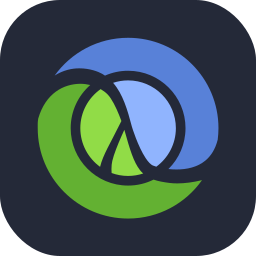 |
|    `cloudflare`    |  |
|      `cmake`       |  |
|     `codepen`      |  |
|   `coffeescript`   |  |
|       `css`        |  |
|     `cypress`      | 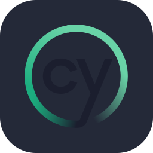 |
|        `d3`        |  |
|       `dart`       |  |
|      `debian`      |  |
|       `deno`       |  |
|      `devto`       |  |
|     `discord`      |  |
|       `bots`       |  |
|    `discordjs`     |  |
|      `django`      |  |
|      `docker`      |  |
|      `dotnet`      |  |
|     `dynamodb`     |  |
|     `eclipse`      |  |
|  `elasticsearch`   |  |
|      `elixir`      | 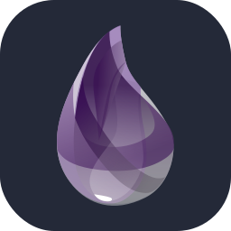 |
|      `elysia`      | 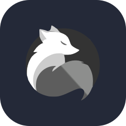 |
|      `emacs`       |  |
|      `ember`       | 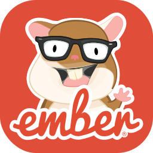 |
|     `emotion`      | 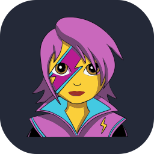 |
|     `express`      |  |
|     `fastapi`      |  |
|    `fediverse`     | 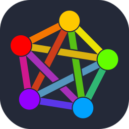 |
|      `figma`       |  |
|     `firebase`     |  |
|      `flask`       |  |
|     `flutter`      |  |
|      `forth`       |  |
|     `fortran`      |  |
| `gamemakerstudio`  |  |
|      `gatsby`      |  |
|       `gcp`        |  |
|       `git`        |  |
|      `github`      |  |
|  `githubactions`   |  |
|      `gmail`       |  |
|     `gherkin`      |  |
|        `go`        |  |
|      `gradle`      |  |
|      `godot`       |  |
|     `grafana`      |  |
|     `graphql`      | 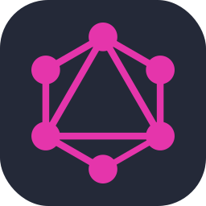 |
|       `gtk`        |  |
|       `gulp`       |  |
|     `haskell`      |  |
|       `haxe`       |  |
|    `haxeflixel`    |  |
|      `heroku`      |  |
|    `hibernate`     |  |
|       `html`       |  |
|       `htmx`       |  |
|       `idea`       |  |
|        `ai`        |  |
|    `instagram`     |  |
|       `ipfs`       | 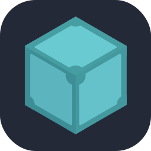 |
|       `java`       |  |
|        `js`        |  |
|     `jenkins`      |  |
|       `jest`       |  |
|      `jquery`      |  |
|      `kafka`       |  |
|       `kali`       |  |
|      `kotlin`      |  |
|       `ktor`       |  |
|    `kubernetes`    |  |
|     `laravel`      |  |
|      `latex`       |  |
|       `less`       |  |
|     `linkedin`     |  |
|      `linux`       |  |
|       `lit`        |  |
|       `lua`        |  |
|        `md`        |  |
|     `mastodon`     |  |
|    `materialui`    |  |
|      `matlab`      |  |
|      `maven`       |  |
|       `mint`       |  |
|     `misskey`      |  |
|     `mongodb`      |  |
|      `mysql`       |  |
|      `neovim`      |  |
|      `nestjs`      |  |
|     `netlify`      |  |
|      `nextjs`      |  |
|      `nginx`       |  |
|       `nim`        |  |
|       `nix`        |  |
|      `nodejs`      |  |
|      `notion`      |  |
|       `npm`        |  |
|      `nuxtjs`      |  |
|     `obsidian`     |  |
|      `ocaml`       |  |
|      `octave`      |  |
|      `opencv`      | 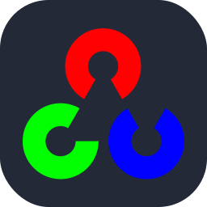 |
|    `openshift`     |  |
|    `openstack`     |  |
|       `p5js`       |  |
|       `perl`       |  |
|        `ps`        |  |
|       `php`        |  |
|     `phpstorm`     | 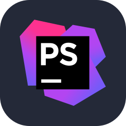 |
|      `pinia`       |  |
|       `pkl`        |  |
|      `plan9`       |  |
|   `planetscale`    |  |
|       `pnpm`       | 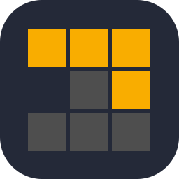 |
|     `postgres`     |  |
|     `postman`      |  |
|    `powershell`    |  |
|        `pr`        |  |
|      `prisma`      |  |
|    `processing`    |  |
|    `prometheus`    |  |
|       `pug`        |  |
|     `pycharm`      |  |
|        `py`        |  |
|     `pytorch`      | 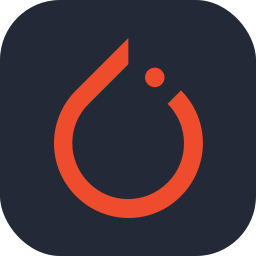 |
|        `qt`        |  |
|        `r`         |  |
|     `rabbitmq`     |  |
|      `rails`       |  |
|   `raspberrypi`    |  |
|      `react`       |  |
|    `reactivex`     |  |
|      `redhat`      |  |
|      `redis`       |  |
|      `redux`       |  |
|      `regex`       |  |
|      `remix`       |  |
|      `replit`      |  |
|      `rider`       |  |
|   `robloxstudio`   |  |
|      `rocket`      |  |
|     `rollupjs`     |  |
|       `ros`        |  |
|       `ruby`       |  |
|       `rust`       |  |
|       `sass`       |  |
|      `spring`      |  |
|      `sqlite`      |  |
|  `stackoverflow`   |  |
|     `sublime`      |  |
|     `supabase`     |  |
|      `scala`       | 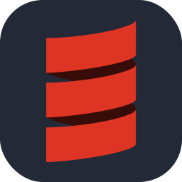 |
|     `sklearn`      |  |
|     `selenium`     |  |
|      `sentry`      |  |
|    `sequelize`     |  |
|     `sketchup`     |  |
|     `solidity`     |  |
|     `solidjs`      |  |
|      `svelte`      |  |
|       `svg`        |  |
|      `swift`       |  |
|     `symfony`      |  |
|     `tailwind`     |  |
|      `tauri`       |  |
|    `tensorflow`    |  |
|    `terraform`     |  |
|     `threejs`      | 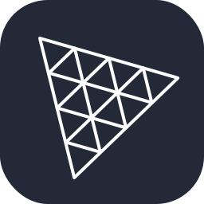 |
|     `twitter`      |  |
|        `ts`        |  |
|      `ubuntu`      |  |
|      `unity`       |  |
|      `unreal`      |  |
|        `v`         |  |
|       `vala`       |  |
|      `vercel`      |  |
|       `vim`        |  |
|   `visualstudio`   |  |
|       `vite`       |  |
|      `vitest`      |  |
|      `vscode`      |  |
|     `vscodium`     |  |
|       `vue`        |  |
|     `vuetify`      |  |
|       `wasm`       |  |
|     `webflow`      |  |
|     `webpack`      |  |
|     `webstorm`     |  |
|     `windicss`     |  |
|     `windows`      |  |
|    `wordpress`     |  |
|     `workers`      |  |
|        `xd`        |  |
|       `yarn`       |  |
|       `yew`        |  |
|       `zig`        |  |
