<h1>Showcase your skills on your GitHub or resumé with ease!</h1>
Powered by Cloudflare Workers ⚡

# Table of contents

- [Table of contents](#table-of-contents)
- [TODO:](#todo)
- [The setup process](#the-setup-process)
  - [The syntax](#the-syntax)
  - [Selecting icons](#selecting-icons)
  - [Customising the icons](#customising-the-icons)
    - [Padding](#padding)
    - [Gaps](#gaps)
    - [Sizing](#sizing)
    - [Orientation](#orientation)
    - [Clickable icons](#clickable-icons)
- [Themed Icons](#themed-icons)
- [Icons Per Line](#icons-per-line)
- [Centering Icons](#centering-icons)
- [New icons progress](#new-icons-progress)
- [New versions of icons to update](#new-versions-of-icons-to-update)
- [Icons List](#icons-list)
- [Self-hosting your own Clouflare worker](#self-hosting-your-own-clouflare-worker)

# TODO:

- [ ] Add most, if not all of the icons from the [skill-icons issues tab](https://github.com/tandpfun/skill-icons/issues).
- [x] Add support for customisable gaps, padding, sizing, orientation ~~& rotation~~.
- [x] Possible support for clickable icons. (Correct links are not yet added to the icons)
- [ ] Possible different colour palettes.
- [ ] Possible auto light/dark theme mode.
- [ ] Remove the need for the SVGs to be kept on the worker, possibly host them in the repo.
- [ ] Create a website for custom icon picking.
- [ ] Add all the links to the icons corresponding to the tool/language.

# The setup process

## The syntax

The SVG can be embedded in two main ways, using Markdown or HTML. Both have the same result.

Markdown:

```md

```

HTML:

```html

```

Result:<br>
<br>


## Selecting icons

Icons are separated using commas, after the `?i=` parameter. You can find a full list of icons [here](#icons-list).
Example: `?i=js,html,css`

```md

```

Result:<br>


## Customising the icons

There are a couple of options for customisablity currently available, including padding, gaps, sizing, orientation and clickable icons.

All parameters have an alias which will work the same as the longhand name.

### Padding

Padding can be added to the icons by appending `&p=` or `&padding=` to the link and adding the number in pixels.
The default size is set to `0`.

Example: `.../icons?i=rust,go&p=50`

Result:<br>


### Gaps

Gaps can be added between the icons by appending `&g=` or `&gap=` to the link and adding the number in pixels. The default size is set to `0`.

Example: `.../icons?i=rust,go&g=50`

Result:<br>


### Sizing

Sizing can be added to the icons by appending `&s=` or `&size=` to the link and adding the number in pixels. The default size is set to `48`.

Example: `.../icons?i=rust,go&s=30`

Result:<br>


### Orientation

Orientation can be added to the icons by appending a `&v` or `&vertical` to the link. This parameter will make all icons vertical. The default orientation is horizontal.

Example: `.../icons?i=rust,go&v`

Result:<br>


### Clickable icons

Icons can be clickable by appending `&c` or `&clickable` to the link. This parameter will enable icons to be clickable.

The link locations are yet to be added as a custom option. Icon links are also yet to be added.

Example: `.../icons?i=rust,go&c`

Result:<br>


# Themed Icons

Some icons have a dark and light themed background. You can specify which theme you want as a url parameter.

This is optional. The default theme is dark.

Change the `&theme=light` to either `dark` or `light`. The theme is the background color, so light theme has a white icon background, and dark has a black-ish.

**Light Theme Example:**

```md
[](https://skillicons.dev)
```

[](https://skillicons.dev)

# Icons Per Line

You can specify how many icons you would like per line! It's an optional argument, and the default is 15.

Change the `&perline=3` to any number between 1 and 50.

```md
[](https://skillicons.dev)
```

[](https://skillicons.dev)

# Centering Icons

Want to center the icons in your readme? The SVGs are automatically resized, so you can do it the same way you'd normally center an image.

```html
<p align="center">
  <a href="https://skillicons.dev">
    
  </a>
</p>
```

<p align="center">
  <a href="https://skillicons.dev">
    
  </a>
</p>

# New versions of icons to update

|   Icon ID   | Icon |
| :---------: | :--: |
| `firebase`  |      |
|     `x`     |      |
|   `deno`    |      |
|     `c`     |      |
|    `css`    |      |
| `jetbrains` |      |
|   `ocaml`   |      |
|   `ember`   |      |
|  `angular`  |  |

# New icons progress

|       Icon ID        | Icon |
| :------------------: | :--: |
|        `hono`        |  |
|      `vagrant`       |  |
|       `gofiber`        |  |
|       `medium`       |  |
|      `geogebra`      |  |
|      `wolfram`       |  |
|   `jetpackcompose`   |  |
|       `canva`        |  |
|      `fivetran`      |  |
|      `oracledb`      |      |
|       `mssql`        |      |
|      `tableau`       |      |
|       `msdos`        |      |
|     `inertiajs`      |      |
|     `servicenow`     |      |
|    `flutterflow`     |      |
|      `netbeans`      |      |
|        `bsky`        |      |
|      `youtube`       |      |
|        `helm`        |      |
|     `playcanvas`     |      |
|        `stan`        |      |
|       `xhtml`        |      |
|       `payara`       |      |
|       `testng`       |      |
|      `fastlane`      |      |
|       `steam`        |      |
|      `mariadb`       |      |
|       `spline`       |      |
|   `dockerjetpack`    |      |
|   `davinciresolve`   |      |
|       `motoko`       |      |
|       `framer`       |      |
|     `devextreme`     |      |
|      `hashnode`      |      |
|    `reactnative`     |      |
|      `vegaspro`      |      |
|        `pwa`         |      |
|       `cpanel`       |      |
|    `intellijidea`    |      |
|     `lightroom`      |      |
|       `stata`        |      |
|       `lottie`       |      |
|       `pytest`       |      |
|      `leetcode`      |      |
|      `navicat`       |      |
|       `argocd`       |      |
|      `coolify`       |      |
|        `gimp`        |      |
|       `unocss`       |      |
|      `socketio`      |      |
|      `posthog`       |      |
|     `passportjs`     |      |
|       `appium`       |      |
|     `snowflake`      |      |
|        `dbt`         |      |
|       `xampp`        |      |
|       `eslint`       |      |
|     `playwright`     |      |
|       `rspack`       |      |
|      `rsbuild`       |      |
|     `storybook`      |      |
|      `mermaid`       |      |
|       `neo4j`        |      |
|        `jwt`         |      |
|     `skeletonui`     |      |
|      `twillio`       |      |
|     `streamlit`      |      |
|      `insomnia`      |      |
|      `flstudio`      |      |
|        `sap`         |      |
|        `abap`        |      |
|      `assembly`      |      |
|  `affinitydesigner`  |      |
|   `affinityphoto`    |      |
| `affinitypublisher`  |      |
|      `inkscape`      |      |
|     `fusion360`      |      |
|      `gromacs`       |      |
|      `robotpy`       |      |
|       `bruno`        |      |
|     `objectivec`     |      |
|      `freebsd`       |      |
|       `zeabur`       |      |
|     `vuesticui`      |      |
|       `quasar`       |      |
|     `vitepress`      |      |
|      `rolldown`      |      |
|  `microwebsockets`   |      |
|        `vike`        |      |
|       `podman`       |      |
|      `esbuild`       |      |
|       `biome`        |      |
|     `puppeteer`      |      |
|      `pkgroll`       |      |
|       `jotai`        |      |
|      `tanstack`      |      |
|      `daisyui`       |      |
|     `burpsuite`      |      |
|        `nano`        |      |
|       `fedora`       |      |
|      `flatpak`       |      |
|      `hyprland`      |      |
|        `sqlc`        |      |
|      `typeorm`       |      |
|      `chatgpt`       |      |
|       `claude`       |      |
|     `perplexity`     |      |
|       `gemini`       |      |
|       `blazor`       |      |
|       `ffmpeg`       |      |
|       `lodash`       |      |
|      `datadog`       |      |
|     `handlebars`     |      |
|     `framerone`      |      |
|        `axos`        |      |
|       `axios`        |      |
|       `vmware`       |      |
|        `gnu`         |      |
|    `googlesheets`    |      |
|       `xcode`        |      |
|    `reactrouter`     |      |
|     `matplotlib`     |      |
|     `babylonjs`      |      |
|      `mongoose`      |      |
|    `apachejmeter`    |      |
|      `shopify`       |      |
|      `geodesdk`      |      |
|        `odin`        |      |
|    `crystallang`     |      |
|      `influxdb`      |      |
|       `pulimi`       |      |
|       `polars`       |      |
|    `cockroachdb`     |      |
|       `kicad`        |      |
|        `gsap`        |      |
|       `pandas`       |      |
|       `numpy`        |      |
|      `ghostty`       |      |
|        `zsh`         |      |
|      `unicode`       |      |
|       `love2d`       |      |
|     `pinescript`     |      |
|    `huggingface`     |      |
|     `timeshift`      |      |
|        `jira`        |      |
|       `render`       |      |
|        `r3f`         |      |
|        `r3r`         |      |
|      `phoenix`       |      |
|     `antdesign`      |      |
|     `karpenter`      |      |
|       `twine`        |      |
|       `ionic`        |      |
|     `turborepo`      |      |
|       `batch`        |      |
|        `fork`        |      |
|      `foundry`       |      |
|     `stackblitz`     |      |
|       `revolt`       |      |
|      `cucumber`      |      |
|     `notepadpp`      |      |
|    `webdriverio`     |      |
|       `defold`       |      |
|       `resend`       |      |
|       `havok`        |      |
|      `audacity`      |      |
|      `doppler`       |      |
|      `firebird`      |      |
|       `ollama`       |      |
|       `trello`       |      |
|       `slack`        |      |
|       `linear`       |      |
|        `mojo`        |      |
|       `gleam`        |      |
|     `protonmail`     |      |
|     `rustrover`      |      |
|      `rubymine`      |      |
|       `goland`       |      |
|      `datagrip`      |      |
|       `gitea`        |      |
|      `semgrep`       |      |
|    `googlecolab`     |      |
|      `chakraui`      |      |
|       `twitch`       |      |
|      `comfyui`       |      |
|      `aseprite`      |      |
|      `drizzle`       |      |
|     `drizzleorm`     |      |
|      `leaflet`       |      |
|       `lunacy`       |      |
|       `pygame`       |      |
|        `cuda`        |      |
|       `icedrs`       |      |
| `oraclesqldeveloper` |      |
|         `vi`         |      |
|      `livewire`      |      |
|    `lightningcss`    |      |
|       `stylus`       |      |
|      `recharts`      |      |
|      `shadcnui`      |      |
|         `d`          |      |
|      `angular`       |      |
|       `pillow`       |      |
|        `arc`         |      |
|        `zen`         |      |
|        `qmk`         |      |
|        `yii`         |      |
|      `dbeaver`       |      |
|    `digitalocean`    |      |
|    `planetscale`     |      |
|       `neondb`       |      |
|       `lumen`        |      |
|       `groovy`       |      |
|        `orca`        |      |
|        `lynx`        |      |
|      `zustand`       |      |
|       `nextui`       |      |
|      `radixui`       |      |
|      `directus`      |      |
|    `visualbasic`     |      |
|        `tidb`        |      |
|       `milvus`       |      |
|       `opengl`       |      |
|        `trpc`        |      |
|       `holyc`        |      |
|      `rubymine`      |      |
|        `zoom`        |      |
|       `pascal`       |      |
|       `turso`        |      |
|       `turst`        |      |
|        `twig`        |      |
|      `opensuse`      |      |
|       `joomla`       |      |
|       `excel`        |      |
|     `pocketbase`     |      |
|      `scratch`       |      |
|      `microtik`      |      |
|        `vyos`        |      |
|       `pihole`       |      |
|       `stripe`       |      |
|       `auth0`        |      |
|     `betterauth`     |      |
|    `supertokens`     |      |
|      `swiftui`       |      |
|      `effector`      |      |
|        `odoo`        |      |
|      `fastify`       |      |
|       `typst`        |      |
|     `springboot`     |      |
|        `warp`        |      |
|        `lvgl`        |      |
|     `adobefonts`     |      |
|    `dreamweaver`     |      |
|   `homeassistant`    |      |
|      `blazejs`       |      |
|     `payloadcms`     |      |
|        `expo`        |      |
|       `grails`       |      |
|       `cobol`        |      |
|     `capacitor`      |      |
|     `googleapi`      |      |
|      `ibmcloud`      |      |
|     `knockoutjs`     |      |
|    `codesandbox`     |      |
|        `kofi`        |      |
|     `wireshark`      |      |
|     `solidstart`     |      |
|       `knexjs`       |      |
|      `mantine`       |      |
|        `gin`         |      |
|       `javafx`       |      |
|       `drawio`       |      |
|     `virtualbox`     |      |
|     `codeblocks`     |      |
|     `reactquery`     |      |
|       `erlang`       |      |
|     `turbopack`      |      |
|  `jupyternotebook`   |      |
|    `applescript`     |      |
|        `lisp`        |      |
|    `vscinsiders`     |      |
|    `sublimetext`     |      |
|     `sveltekit`      |      |
|        `jsr`         |      |
|        `tmux`        |      |
|   `testcontainers`   |      |
|        `zod`         |      |
|   `standardschema`   |      |
|       `pixijs`       |      |
|     `awslambda`      |      |
|        `rxjs`        |      |
|        `quik`        |      |
|      `nextauth`      |      |
|   `googlebigquery`   |      |
|       `julia`        |      |
|   `opentelemetry`    |      |
|        `elm`         |      |
|       `flyio`        |      |
|       `webrtc`       |      |
|       `kaggle`       |      |
|         `vb`         |      |
|        `vba`         |      |
|      `vbscript`      |      |
|       `delphi`       |      |
|       `reatom`       |      |
|      `scylladb`      |      |
|        `ajax`        |      |
|        `mui`         |      |
|      `protobuf`      |      |
|        `grpc`        |      |
|     `clickhouse`     |      |
|      `postcss`       |      |
|    `fontawesome`     |      |
|        `hexo`        |      |
|    `px4autopilot`    |      |
|       `mocha`        |      |
|        `chai`        |      |
|      `xamarin`       |      |
|       `vulkan`       |      |
|      `directX`       |      |
|     `surrealdb`      |      |
|        `venv`        |      |
|       `gentoo`       |      |

# Icons List

Here's a list of all the icons currently supported. Feel free to open an issue to suggest icons to add!

|      Icon ID       |                            Icon                            |
| :----------------: | :--------------------------------------------------------: |
|     `ableton`      |        |
|   `activitypub`    |    |
|      `actix`       |          |
|      `adonis`      |            |
|        `ae`        |      |
|     `aiscript`     |       |
|     `alpinejs`     |   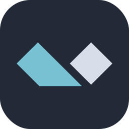    |
|     `anaconda`     |       |
|  `androidstudio`   |  |
|     `angular`      |        |
|     `ansible`      |           |
|      `apollo`      |            |
|      `apple`       |     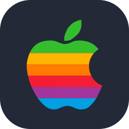     |
|     `appwrite`     |          |
|       `arch`       |           |
|     `arduino`      |            |
|      `astro`       |             |
|       `atom`       |              |
|        `au`        |          |
|     `autocad`      |        |
|       `aws`        |            |
|       `azul`       |              |
|      `azure`       |          |
|      `babel`       |             |
|       `bash`       |           |
|       `bevy`       |           |
|    `bitbucket`     |      |
|     `blender`      |        |
|    `bootstrap`     |         |
|       `bsd`        |            |
|       `bun`        |            |
|        `c`         |                 |
|        `cs`        |        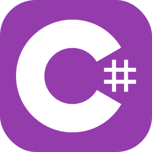        |
|       `cpp`        |               |
|     `crystal`      |        |
|    `cassandra`     |      |
|      `clion`       |          |
|     `clojure`      |        |
|    `cloudflare`    |     |
|      `cmake`       |     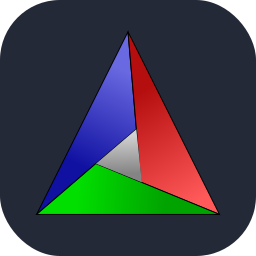     |
|     `codepen`      |        |
|   `coffeescript`   |   |
|       `css`        |               |
|     `cypress`      |        |
|        `d3`        |             |
|       `dart`       |           |
|      `debian`      |         |
|       `deno`       |           |
|      `devto`       |          |
|     `discord`      |           |
|       `bots`       |       |
|    `discordjs`     |      |
|      `django`      |            |
|      `docker`      |            |
|      `dotnet`      |            |
|     `dynamodb`     |       |
|     `eclipse`      |        |
|  `elasticsearch`   | 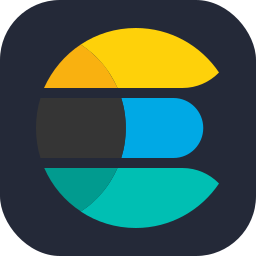 |
|     `electron`     |          |
|      `elixir`      |         |
|      `elysia`      |         |
|      `emacs`       |             |
|      `ember`       |             |
|     `emotion`      |        |
|     `express`      |      |
|     `fastapi`      |           |
|    `fediverse`     |      |
|      `figma`       |          |
|     `firebase`     |       |
|      `flask`       |          |
|     `flutter`      |        |
|      `forth`       |             |
|     `fortran`      |           |
| `gamemakerstudio`  |          |
|      `gatsby`      |            |
|       `gcp`        |            |
|       `git`        |               |
|      `github`      |         |
|  `githubactions`   |  |
|      `gitlab`      |         |
|      `gmail`       |          |
|     `gherkin`      |        |
|        `go`        |            |
|      `gradle`      |         |
|      `godot`       |          |
|     `grafana`      |        |
|     `graphql`      |        |
|       `gtk`        |            |
|       `gulp`       |              |
|     `haskell`      |        |
|       `haxe`       |           |
|    `haxeflixel`    |     |
|      `heroku`      |            |
|    `hibernate`     |      |
|       `html`       |              |
|       `htmx`       |     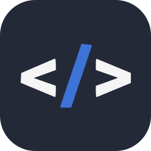      |
|       `idea`       |           |
|        `ai`        |       |
|    `instagram`     |         |
|       `ipfs`       |           |
|       `java`       |           |
|        `js`        |        |
|     `jenkins`      |        |
|       `jest`       |              |
|      `jquery`      |            |
|      `kafka`       |             |
|       `kali`       |           |
|      `kotlin`      |         |
|       `ktor`       |     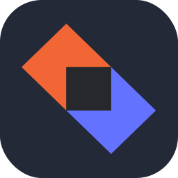      |
|    `kubernetes`    |        |
|     `laravel`      |        |
|      `latex`       |          |
|       `less`       |           |
|     `linkedin`     |          |
|      `linux`       |          |
|       `lit`        |            |
|       `lua`        |            |
|        `md`        |       |
|     `mastodon`     |       |
|    `materialui`    |     |
|      `matlab`      |         |
|      `maven`       |          |
|       `mint`       |           |
|     `misskey`      |        |
|     `mongodb`      |           |
|      `mysql`       |          |
|      `neovim`      |         |
|      `nestjs`      |         |
|     `netlify`      |        |
|      `nextjs`      |         |
|      `nginx`       |             |
|       `nim`        |            |
|       `nix`        |            |
|      `nodejs`      |         |
|      `notion`      |         |
|       `npm`        |            |
|      `nuxtjs`      |         |
|     `obsidian`     |       |
|      `ocaml`       |             |
|      `octave`      |    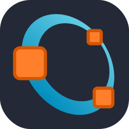     |
|         ``         |               |
|    `openshift`     |                |
|    `openstack`     |      |
|       `p5js`       |              |
|       `perl`       |              |
|        `ps`        |         |
|       `php`        |            |
|     `phpstorm`     |       |
|      `pinia`       |          |
|       `pkl`        |            |
|      `plan9`       |          |
|   `planetscale`    |    |
|       `pnpm`       |           |
|     `postgres`     |     |
|     `postman`      |           |
|    `powershell`    |     |
|        `pr`        |          |
|      `prisma`      |            |
|    `processing`    |     |
|    `prometheus`    |        |
|       `pug`        |            |
|     `pycharm`      |        |
|        `py`        |         |
|     `pytorch`      |        |
|        `qt`        |             |
|        `r`         |              |
|     `rabbitmq`     |       |
|      `rails`       |             |
|   `raspberrypi`    |    |
|      `react`       |          |
|    `reactivex`     |   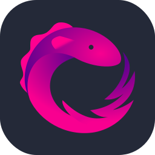   |
|      `redhat`      |         |
|      `redis`       |          |
|      `redux`       |             |
|      `regex`       |          |
|      `remix`       |          |
|      `replit`      |         |
|      `rider`       |          |
|   `robloxstudio`   |      |
|      `rocket`      |            |
|     `rollupjs`     |       |
|       `ros`        |            |
|       `ruby`       |              |
|       `rust`       |              |
|       `sass`       |              |
|      `spring`      |         |
|      `sqlite`      |            |
|  `stackoverflow`   |  |
| `styledcomponents` |  |
|     `sublime`      |        |
|     `supabase`     |       |
|      `scala`       |          |
|     `sklearn`      |    |
|     `selenium`     |          |
|      `sentry`      |            |
|    `sequelize`     |      |
|     `sketchup`     |       |
|     `solidity`     |          |
|     `solidjs`      |        |
|      `svelte`      |            |
|       `svg`        |            |
|      `swift`       |             |
|     `symfony`      |    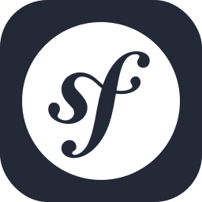    |
|     `tailwind`     |    |
|      `tauri`       |          |
|    `tensorflow`    |     |
|    `terraform`     |      |
|     `threejs`      |        |
|     `twitter`      |           |
|        `ts`        |        |
|      `ubuntu`      |         |
|      `unity`       |          |
|      `unreal`      |      |
|        `v`         |              |
|       `vala`       |              |
|      `vercel`      |         |
|       `vim`        |            |
|   `visualstudio`   |   |
|       `vite`       |           |
|      `vitest`      |         |
|      `vscode`      |         |
|     `vscodium`     |       |
|       `vue`        |          |
|     `vuetify`      |        |
|       `wasm`       |       |
|     `webflow`      |           |
|     `webpack`      |        |
|     `webstorm`     |       |
|     `windicss`     |   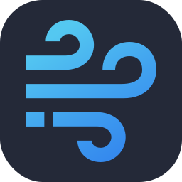    |
|     `windows`      |        |
|    `wordpress`     |         |
|     `workers`      |        |
|        `xd`        |                |
|       `yarn`       |           |
|       `yew`        |      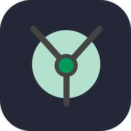      |
|       `zig`        |            |

# Self-hosting your own Clouflare worker

TODO readme :]
